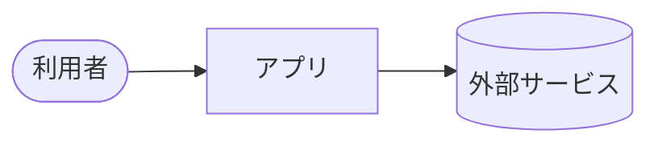
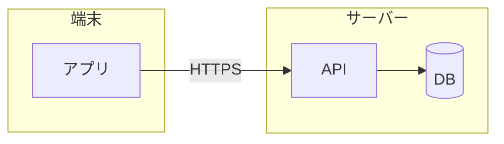

# システム全体図

C4 モデルのコンテキスト図とコンテナ図の考え方で、Mermaid の flowchart で描く（Mermaid の C4 の書き方は実験的で、GitHub では表示されないため）。

## コンテキスト

```mermaid
flowchart LR
  user([利用者])
  app[アプリ]
  ext[(外部サービス)]
  user --> app
  app --> ext
```

## コンテナ

```mermaid
flowchart LR
  subgraph client[端末]
    app[アプリ]
  end
  subgraph server[サーバー]
    api[API]
    db[(DB)]
  end
  app -->|HTTPS| api
  api --> db
```
